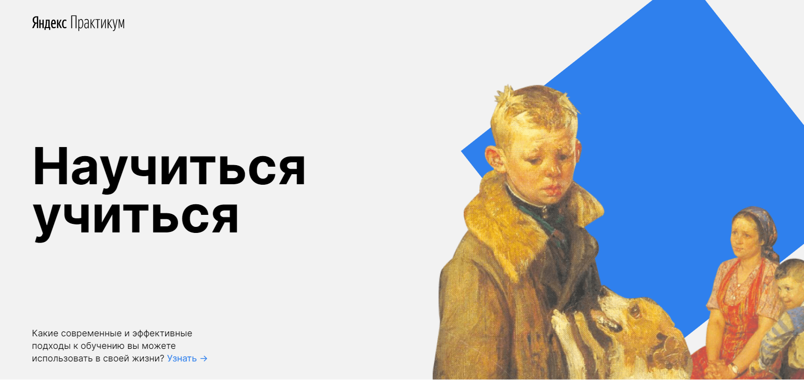

# "Научиться учиться" - landing page
Основная цель лендинга — рассказать о проблемах и способах быстрого и эффективного обучения. На странице можно найти 5 практик обучения от Барбары Оакли, видео о прокрастинации, информацию о методе Фейнмана, различные принципы обучения и многое другое.

## Используемые технологии
- Лендинг написан на HTML5 и CSS3;
- Файловая структура организована по методологии БЭМ Nested;
- Используются семантические теги;
- Для построения сетки, применяется flexbox.

## Ссылка на GitHub Pages
[steanull.github.io/how-to-learn/](https://steanull.github.io/how-to-learn/)
